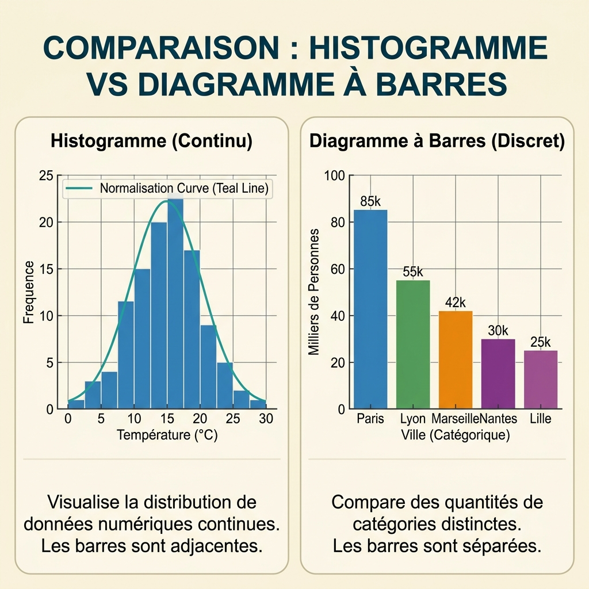

## 📊 Preuves Unidimensionnelles : La Distribution du Signal

::: {.card .card-info}
::: {.card-header}
💡 Concept Clé : La Grammaire des Graphiques
:::
::: {.card-body}
Avant de coder, il faut comprendre l'anatomie d'une image. La Data Visualisation moderne repose sur la **Grammar of Graphics** : une décomposition en couches indépendantes (Données, Esthétiques, Géométries). Un mauvais choix graphique est une faute d'enquête qui induit le décideur en erreur [@4_visualisation_md].
:::
:::
Quand on explore une seule variable (Analyse 1D), l'objectif est de comprendre sa **distribution** ou sa **composition**.

### 🔎 Les Géométries de Référence

1. **L'Histogramme (Continu) :** L'outil roi pour analyser une variable quantitative (ex: Salaire). Les barres sont **adjacentes** (aucun espace) pour symboliser la continuité mathématique.
2. **Le Diagramme à Barres (Discret) :** Compare des catégories distinctes (ex: Ville). Il y a **toujours un espace** entre les barres.
3. **Le Diagramme Circulaire (Camembert) :** À limiter strictement à **2 ou 3 catégories** (ex: Oui/Non). L'œil humain gère mal les angles ; préférez un Bar Chart pour plus de précision.

---

### ⚖️ Comparaison : Histogramme vs Bar Chart

{width=80%}
[🔍 Zoom sur la comparaison](../../assets/illustrations/hist_vs_bar.png){.zoom}

---

::: {.card .card-warning}
::: {.card-header}
⚠️ Danger : Le Biais Visuel
:::
::: {.card-body}
N'utilisez jamais de 3D décorative sur vos graphiques. Cela introduit des distorsions de perspective qui faussent la perception des proportions. Un enquêteur doit rester factuel.
:::
:::
::: {.card .card-success}
::: {.card-header}
🎒 Astuce Pro : Choix de la couleur
:::
::: {.card-body}
Utilisez la couleur pour mettre en évidence une anomalie ou une catégorie spécifique, et non pour faire du "coloriage". Chaque variable visuelle doit porter une information.
:::
:::
